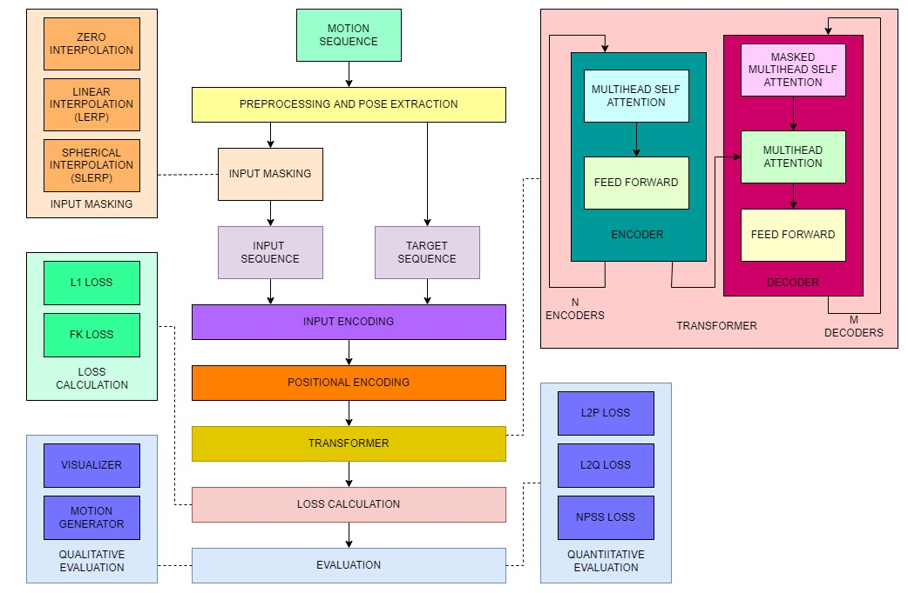

# Transformer based Motion In-betweening

In-Betweening is the process of drawing transition frames between temporally-sparse keyframes to create a smooth animation sequence. This work presents a novel transformer based in betweening technique that serves as a tool for 3D animators.


## Visualizer

https://user-images.githubusercontent.com/44777563/182904169-af1d0b4d-a023-4ddd-b33e-b5a4ec4aa717.mp4


## Motion Generator

https://user-images.githubusercontent.com/44777563/182904188-ce43c556-7472-47d2-bc04-c5cb868674b6.mp4


## Architecture


## Downloading Data


### LAFAN1 Dataset

- Download the dataset from [Ubisoft's Github Repository](https://github.com/ubisoft/ubisoft-laforge-animation-dataset/blob/master/lafan1/lafan1.zip) and extract it to `/data/lafan1/`

## Installation

1. Install Pre-Requisites 

    - Python 3.9
    - PyTorch 1.10

2. Clone the repository
    ```git clone https://github.com/Pavi114/motion-completion-using-transformers```

3. Copy config/default.yml to config/`model_name`.yml and edit as needed.

4. Install Python Dependencies

    - Create a virtualenv: `python3 -m virtualenv -p python3.9 venv`

    - Install Dependencies: `pip install -r requirements.txt`

## Execution

First activate the venv: `source venv/bin/activate`

### Training

```
train.py [-h] [--model_name MODEL_NAME] [--save_weights | --no-save_weights] [--load_weights | --no-load_weights]

optional arguments:
  -h, --help            show the help message and exit
  --model_name MODEL_NAME
                        Name of the model. Used for loading and saving weights.
  --save_weights, --no-save_weights
                        Save model weights. (default: False)
  --load_weights, --no-load_weights
                        Load model weights. (default: False)
```

### Visualization

```
visualize.py [-h] [--model_name MODEL_NAME]

optional arguments:
  -h, --help            show the help message and exit
  --model_name MODEL_NAME
                        Name of the model. Used for loading and saving weights.
```

### Evaluation

```
evaluate.py [-h] [--model_name MODEL_NAME]

optional arguments:
  -h, --help            show the help message and exit
  --model_name MODEL_NAME
                        Name of the model. Used for loading and saving weights.
```

### Running Visualizer

0. Navigate to `./viz` directory

    ```
    cd ./viz
    ```

1. Install NPM Modules

    ```
    npm install
    ```

2. Build visualizer

    ```
    npm run build
    ```

3. Copy output file to `./dist`

    ```
    cp output/[MODEL_NAME] viz/dist/static/animations/[MODEL_NAME]
    ```

4. Run viz

    ```
    npm start
    ```


